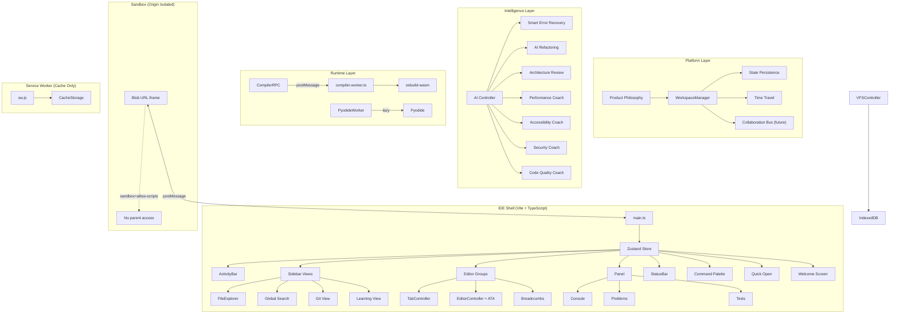

# Code Editor Live V3.0+ — Definitive Platform Architecture

> Not an IDE. A developer platform.

---

## Product Philosophy

### Code Editor Live Principles

1. **Zero waiting.** Every interaction responds in under 16ms. Compilation is invisible.
2. **Zero confusion.** Every error becomes a learning opportunity. No cryptic stack traces.
3. **Zero setup.** Click → code → preview. No npm install, no terminal, no config files.
4. **Every action reversible.** Undo everything. Time-travel across workspace states.
5. **Keyboard-first.** 95% of actions reachable without a mouse.
6. **Mouse-friendly.** Drag, click, hover — everything discoverable for visual learners.
7. **Beginner-friendly.** A 14-year-old building their first website should feel empowered, not intimidated.
8. **Professional enough for production.** A senior engineer should never feel limited.
9. **AI assists, never interrupts.** Intelligence is ambient. It surfaces when relevant, hides when not.
10. **Performance before features.** A fast IDE with fewer features beats a slow IDE with more.

### Visual Philosophy

- **Calm over flashy.** The interface should feel like a quiet workspace, not a dashboard.
- **Typography-first.** Hierarchy communicated through weight and size, not color.
- **Spacing system.** Strict 4px / 8px grid. No arbitrary pixel values.
- **Color conveys state, never decoration.** Blue = active. Red = error. Amber = warning. Green = success. Everything else is neutral.
- **Motion only when meaningful.** Transitions communicate spatial relationships (panel opening, tab switching). Never animate for decoration.
- **Every pixel has a purpose.** If a UI element doesn't help the user write, debug, or understand code, remove it.

---

## Decisions (Locked In)

| Decision | Choice | Rationale |
|----------|--------|-----------|
| Build System | Vite + TypeScript | Type safety, tree-shaking, code splitting, worker bundling |
| Sandbox | Blob URL injection | True origin isolation. SW only for caching |
| Pyodide | Lazy load on `.py` open | Never eagerly load 15MB |
| Layout Model | Desktop IDE shell | Activity Bar → Sidebar → Editor Groups → Panel → Status Bar |
| State | Zustand | Lightweight, TypeScript-native, serializable |
| Preview | Blob URL + postMessage RPC | Zero SW dependency for rendering |
| Key Storage | Web Crypto API | AES-GCM encrypted, session-only option, never in localStorage |
| Icons | Lucide SVG | Professional, tree-shakeable, zero emojis |
| Fonts | Self-hosted Inter + JetBrains Mono | Zero CDN dependency |

---

## Architecture



---

## Layout Hierarchy

```
┌─────────────────────────────────────────────────────────────┐
│                                                             │
├────┬────────────────────────────────────────────────────────┤
│    │  src › components › App.tsx                            │
│ ☰  │ ┌─────────┬──────────┬─────────┐                      │
│ 🔍 │ │ App.tsx •│ index.ts │ style.c…│  ×                   │
│ ᛘ  │ ├─────────┴──────────┴─────────┼──────────────────────┤
│ 🧩 │ │                              │  🔒 localhost:3000    │
│ ✨ │ │    CodeMirror Editor          │  ↻  □  📱  💻       │
│    │ │                              │ ┌──────────────────┐ │
│    │ │                              │ │                  │ │
│    │ │                              │ │  [Live Preview]  │ │
│    │ │                              │ │                  │ │
│    │ │                              │ └──────────────────┘ │
│    │ ├──────────────────────────────┴──────────────────────┤
│    │ │ Console │ Problems (3) │ Tests │                     │
│    │ │ ⓘ Build completed in 8ms                            │
│    │ │ ⚠ Unused variable 'x' at App.tsx:12                 │
│ ⚙  │ │ ⓧ TypeError: Cannot read... at App.tsx:24          │
├────┴─┴─────────────────────────────────────────────────────┤
│ ● main │ ✓ Ready │ 0↑ 0↓     │ JSX │ UTF-8 │ Sp:2 │ Ln 42│
└─────────────────────────────────────────────────────────────┘
```

---

## Proposed Changes

### Phase 1 — Vite Scaffold & Foundation

#### [NEW] `package.json`
Dependencies: `codemirror` (all extensions), `@isomorphic-git/lightning-fs`, `isomorphic-git`, `esbuild-wasm`, `zustand`, `lucide`. DevDeps: `vite`, `typescript`, `vitest`.

#### [NEW] `tsconfig.json`
Strict mode, ES2022, ESNext modules, `@/` path alias.

#### [NEW] `vite.config.ts`
Worker bundling (`?worker`), `public/sw.js` passthrough, `public/esbuild.wasm` copy, self-hosted fonts.

#### [NEW] `src/store/index.ts` — Zustand Store
```ts
interface IDEStore {
  // Workspace
  activeView: 'explorer' | 'search' | 'git' | 'learn' | 'ai';
  sidebarVisible: boolean;
  panelVisible: boolean;
  panelTab: 'console' | 'problems' | 'tests';
  
  // Layout (persisted)
  sidebarWidth: number;
  panelHeight: number;
  editorPreviewRatio: number;
  
  // Editor
  openTabs: TabState[];
  activeTabId: string | null;
  editorStates: Map<string, SerializedEditorState>;
  
  // Build
  buildState: 'idle' | 'compiling' | 'ready' | 'error';
  diagnostics: Diagnostic[];
  
  // Git
  branch: string;
  changedFiles: GitFileStatus[];
  
  // Workspace Memory
  saveWorkspace(): void;
  restoreWorkspace(): void;
}
```
Full workspace persistence: serialized to IndexedDB on every layout change, restored exactly on boot.

---

### Phase 2 — IDE Shell & Splitter Engine

#### [NEW] `src/index.html`
Semantic HTML shell. Zero inline styles. Key elements:
- `#activity-bar` (48px left strip)
- `#sidebar` (260px collapsible)
- `#editor-area` (flex:1, breadcrumbs + tabs + editor + splitter + preview)
- `#panel` (bottom, console/problems/tests)
- `#status-bar` (24px fixed bottom)
- `<dialog id="command-palette">`, `<dialog id="quick-open">`, `<dialog id="settings-modal">`
- `#notifications` (toast container, bottom-right)
- `#drag-shield` (hidden, activated during splitter drag)

#### [NEW] `src/styles/tokens.css`
Design system: surfaces (`--surface-0` through `--surface-active`), text hierarchy, accent colors, semantic colors, border colors. Strict 4px/8px spacing variables.

#### [NEW] `src/styles/layout.css`
CSS Grid root + nested Flexbox. Every child: `min-width:0; min-height:0; overflow:hidden`. Splitter gutters: 4px, transition on hover.

#### [NEW] `src/styles/components.css`, `editor.css`, `scrollbar.css`
Component styles, CodeMirror overrides (visible cursor, caret-color, focus fix), thin 6px scrollbars.

#### [NEW] `src/ui/SplitController.ts`
`setPointerCapture()`, `requestAnimationFrame` throttle, `#drag-shield` overlay during drag, min/max constraints, persists to Zustand, calls `editorView.requestMeasure()` after resize.

#### [NEW] `src/ui/ActivityBar.ts`
Lucide SVG icons: Explorer, Search, Git, Extensions, AI. Settings gear bottom-anchored. Active: `border-left: 2px solid var(--accent)`. Double-click collapses sidebar.

---

### Phase 3 — Editor, Tabs & Navigation

#### [NEW] `src/editor/EditorController.ts`
Per-file `EditorState` cache (cursor, scroll, undo). Compartmentalized language/theme/autocomplete. Auto-focus on every file switch. Custom keybindings (Cmd+S, Cmd+P, Cmd+Shift+P, Cmd+Shift+F).

#### [NEW] `src/ui/TabController.ts`
`Map<string, TabState>` with dirty flag, editor state snapshot. Lucide file icons. Active: `border-top: 2px solid var(--accent)`. Dirty: `●` dot. Close: `×` on hover. Middle-click close. Horizontal scroll overflow.

#### [NEW] `src/ui/Breadcrumbs.ts`
Path segments above tabs: `src › components › App.tsx`. Each clickable → Quick Open filtered to directory.

#### [NEW] `src/ui/CommandPalette.ts`
`Ctrl+Shift+P`. `<dialog>` + `backdrop-filter: blur(8px)`. Fuzzy search. Command registry with categories. Recently used pinned at top.

#### [NEW] `src/ui/QuickOpen.ts`
`Ctrl+P`. Fuzzy filename search across VFS. File icons. Recent files shown by default.

#### [NEW] `src/ui/GlobalSearch.ts`
`Ctrl+Shift+F`. Sidebar view. Regex/case/word toggles. Replace. Results grouped by file with line previews. Click → open at line.

---

### Phase 4 — Blob URL Sandbox & Compiler

#### [NEW] `src/worker/compiler.worker.ts`
esbuild-wasm from local WASM. VFS plugin + CDN plugin. Dynamic entry detection. `sourcemap: 'inline'`. CSS extraction. Build ID tracking.

#### [NEW] `src/worker/CompilerRPC.ts`
Type-safe `build(entry, vfsTree): Promise<BuildResult>`. Auto build IDs. Timeout. Cancellation.

#### [NEW] `src/sandbox/SandboxController.ts`
**Blob URL engine:**
1. Compose HTML: user's `index.html` + inlined JS bundle + inlined CSS + HMR bridge + error telemetry + React unmount + Tailwind v4
2. `new Blob([html], {type: 'text/html'})` → `URL.createObjectURL(blob)`
3. `iframe.src = blobURL` with `sandbox="allow-scripts"` only (NO `allow-same-origin`)
4. Revoke previous Blob URL to prevent memory leaks
5. HMR: for JS-only changes, `postMessage({type:'HMR_UPDATE', code})` to iframe (preserves React state). Full Blob replacement only when HTML changes.

#### [NEW] `src/ui/BrowserChrome.ts`
`🔒 localhost:3000` address bar, refresh, external link, viewport buttons (Desktop/Tablet/Mobile). Network throttle indicator (future).

#### [MODIFY] `public/sw.js`
Cache only. Cache-First for CDN (esm.sh, unpkg, jsdelivr). Cache esbuild.wasm. Cache app shell. No `/sandbox/` routing.

---

### Phase 5 — Console, Problems & Status Bar

#### [NEW] `src/console/ConsoleController.ts`
Severity pills (INFO blue, WARN amber, ERROR red). Timestamps. Collapsible stack traces (clickable → open file at line). JSON tree viewer. Filter dropdown. Search. `console.group`/`console.table` support. JetBrains Mono 13px.

#### [NEW] `src/console/ProblemsPanel.ts`
Aggregated diagnostics from: esbuild errors, runtime errors, type errors, a11y warnings, security warnings. Each entry: icon + message + `file:line:col`. Click → opens file. Count badge on tab.

#### [NEW] `src/ui/StatusBar.ts`
Left: `● main` (branch), `✓ Ready` (build), `0↑ 0↓` (git). Right: `JSX` (language), `UTF-8`, `Sp:2`, `Ln 42 Col 8`.

#### [NEW] `src/ui/Notifications.ts`
Toast system (bottom-right). Info/Warn/Error severity. Auto-dismiss 5s. Action buttons. Stacking with slide animation.

---

### Phase 6 — File Explorer & Git

#### [NEW] `src/explorer/FileExplorer.ts`
Lucide SVG icons. Collapsible directories. Active: subtle accent background + left border. Section headers: uppercase, 0.65rem, letter-spacing. Context menu (New File, Rename, Delete, Duplicate). Inline rename. Git decorations (M/U/D badges).

#### [NEW] `src/git/GitController.ts`
Clone (progress bar), commit (staged list), push, branch list, status. Auth: in-memory only, never persisted. Optional Web Crypto encrypted storage.

#### [NEW] `src/git/GitView.ts`
Sidebar view: changed files, stage/unstage, commit input, push button.

---

### Phase 7 — IntelliSense, Python & Offline

#### [NEW] `src/editor/ATA.ts`
Watch package.json → fetch `.d.ts` from `esm.sh/{pkg}?dts` → feed to `@codemirror/autocomplete`. Debounced 500ms. Cached in IndexedDB.

#### [NEW] `src/runtimes/PyodideWorker.ts`
Lazy load on first `.py` open. Status bar indicator during load. stdout/stderr → Console. postMessage RPC.

#### [MODIFY] `public/sw.js`
Add offline: cache all app assets on install, cache CDN on first fetch, offline fallback.

---

### Phase 8 — Developer Intelligence Layer

> *This is what makes users stay.*

#### [NEW] `src/ai/AIController.ts`
Central AI orchestrator. BYOK (Gemini/OpenAI/Anthropic). All AI calls go through this controller with:
- VFS context injection (current file + related files)
- Token budgeting
- Streaming responses
- Rate limiting

#### [NEW] `src/ai/KeyManager.ts`
Web Crypto API encryption (AES-GCM). PBKDF2 key derivation from user passphrase. IndexedDB storage. Session-only option. Provider abstraction. Never exposed to preview iframe.

#### [NEW] `src/ai/SmartErrorRecovery.ts`
Transforms runtime errors into actionable guidance:
```
Input:  TypeError: Cannot read properties of undefined (reading 'map')
Output: "You're calling .map() on a variable that is undefined.
         This usually happens when data hasn't loaded yet.
         
         Suggested fixes:
         ✓ Add optional chaining: data?.map(...)
         ✓ Add a loading check: if (!data) return <Loading />
         ✓ Initialize with default: const [data, setData] = useState([])
         
         Confidence: 96%"
```
Works without AI API key using pattern matching for common errors. With API key, uses LLM for complex errors.

#### [NEW] `src/ai/AIRefactor.ts`
**Cmd+K** inline editing:
- Select code → type instruction → AI generates replacement
- Diff preview (CodeMirror merge view) before accepting
- One-click actions: Optimize, Convert to TypeScript, Split component, Generate tests, Generate docs, Improve accessibility, Reduce bundle size

#### [NEW] `src/ai/ArchitectureReview.ts`
Background analysis (runs on save, debounced):
- File length warnings (>300 lines → suggest split)
- Component responsibility count
- Dependency graph complexity
- Suggested refactoring with file structure preview
- Only surfaces when genuinely useful (not noisy)

#### [NEW] `src/ai/coaches/PerformanceCoach.ts`
Real-time bundle analysis:
- Track output size after each build
- Identify heavy imports (lodash full import → suggest tree-shaking)
- Suggest code splitting opportunities
- Display in status bar: `Bundle: 112KB (41KB saveable)`

#### [NEW] `src/ai/coaches/AccessibilityCoach.ts`
Real-time a11y scanning:
- Missing `aria-label` on interactive elements
- Color contrast ratio violations
- Missing alt text
- Keyboard navigation gaps
- Results feed into Problems panel

#### [NEW] `src/ai/coaches/SecurityCoach.ts`
Static analysis for:
- Hardcoded API keys/secrets
- `innerHTML` with user input (XSS)
- `eval()` usage
- Prototype pollution patterns
- Results as warnings in Problems panel

#### [NEW] `src/ai/coaches/CodeQualityCoach.ts`
Human-language code quality feedback:
- "This component has 8 responsibilities. Consider splitting."
- "This function is 45 lines. The sweet spot is under 20."
- "Estimated cognitive complexity: High."
- Non-blocking: surfaces as subtle hints, never modal alerts

---

### Phase 9 — Retention & Delight Features

#### [NEW] `src/welcome/WelcomeScreen.ts`
First-run experience (shown when no workspace exists):
- Logo + tagline: "Write. Preview. Ship. All in your browser."
- Template gallery:
  - 🌐 HTML Playground
  - ⚛️ React App
  - 🎨 Portfolio Site
  - 🐍 Python Project
  - 🧪 Algorithm Practice
  - 🤖 AI Chatbot
  - 🎮 Canvas Game
- "Clone Repository" button
- "Open Recent" list (persisted workspaces)
- Keyboard shortcuts cheat sheet
- "What's New" section

#### [NEW] `src/welcome/BeginnerMode.ts`
Activated automatically for first-time users (or via Command Palette):
- Contextual tooltips on hover ("This is the file explorer — your project files live here")
- Simplified error messages (SmartErrorRecovery always active)
- "Need help? Press Space" mentor prompt
- Step-by-step guided tour of IDE features
- Progressively reveals advanced features as user's skill grows

#### [NEW] `src/learn/LearningView.ts`
Sidebar view (Activity Bar → graduation cap icon):
- Interactive missions organized by track:
  - **HTML/CSS Track:** Variables → Selectors → Flexbox → Grid → Animations
  - **JavaScript Track:** Variables → Functions → Objects → DOM → Async
  - **React Track:** Components → State → Hooks → Effects → Context
  - **Python Track:** Basics → Data Structures → Algorithms
- Each mission: instruction panel + editable code + auto-grading via vitest-lite assertions
- Progress saved to IndexedDB
- Achievement badges

#### [NEW] `src/learn/CompetitiveProgramming.ts`
Workspace mode (Command Palette → "Competitive Programming Mode"):
- Layout changes: Editor (left) + Input/Output (right) + Test Cases (bottom)
- Timer widget (start/pause/lap)
- Problem statement panel
- Test case editor (input → expected output)
- One-click run against all test cases
- Complexity analysis (Big-O estimation for common patterns)
- Templates: C++, Python, JavaScript, TypeScript

#### [NEW] `src/workspace/WorkspaceManager.ts`
Complete state restoration:
- Serialized on every state change to IndexedDB
- Restored on boot: tabs, cursor positions, scroll offsets, splitter sizes, active view, panel state, sidebar state, preview viewport, theme, zoom level
- Named workspaces: switch between projects
- Export/Import workspace as JSON

#### [NEW] `src/workspace/TimeTravel.ts`
Workspace snapshots:
- Automatic snapshot every 5 minutes (configurable)
- Manual snapshot via Command Palette ("Save Checkpoint")
- Timeline scrubber in panel
- Restore any snapshot: all files revert, tabs restore, cursor positions restore
- Snapshots stored in IndexedDB with timestamp + description
- Diff view between snapshots

#### [NEW] `src/collab/CollaborationBus.ts`
Architecture foundation for future collaboration:
- Event bus abstraction: `emit(event, data)`, `on(event, callback)`
- Operation Transform / CRDT-ready data model
- Awareness protocol interface (cursor positions, selections, usernames)
- Transport abstraction (WebRTC / WebSocket — pluggable, not implemented yet)
- All editor mutations route through this bus (enables future sync without refactoring)

---

### Phase 10 — Platform Roadmap Architecture

> *These are not implemented now. The architecture is designed to support them.*

#### [NEW] `src/plugins/PluginAPI.ts`
Extension system foundation:
```ts
interface PluginManifest {
  id: string;
  name: string;
  version: string;
  activationEvents: string[];
  contributes: {
    commands?: CommandContribution[];
    languages?: LanguageContribution[];
    themes?: ThemeContribution[];
    views?: ViewContribution[];
    coaches?: CoachContribution[];
  };
}
```
- Command registry extension
- Language registration
- Theme registration
- View contribution (sidebar panels)
- Coach contribution (custom intelligence plugins)
- Sandboxed execution (plugins run in worker)

#### [DESIGNED] Extension Marketplace
Architecture supports a future marketplace:
- Plugin discovery API endpoint
- Install from URL or manifest
- Enable/disable per workspace
- Plugin settings storage

#### [DESIGNED] One-Click Deploy
Integration points prepared for:
- Vercel (via API token)
- GitHub Pages (via isomorphic-git push to `gh-pages` branch)
- Netlify (via API)
- Cloudflare Pages (via API)
- All deployment runs client-side via fetch API — no backend

#### [DESIGNED] Cloud Sync
Architecture supports future sync:
- Workspace state serializable as JSON
- VFS exportable as tar
- Git-based sync (push workspace to private repo)
- Optional: Firebase/Supabase integration for real-time sync

---

## File Structure

```
Code-Editor-Live/
├── public/
│   ├── sw.js
│   ├── esbuild.wasm
│   └── fonts/
│       ├── inter-*.woff2
│       └── jetbrains-mono-*.woff2
├── src/
│   ├── main.ts
│   ├── index.html
│   ├── store/
│   │   └── index.ts
│   ├── styles/
│   │   ├── tokens.css
│   │   ├── layout.css
│   │   ├── components.css
│   │   ├── editor.css
│   │   └── scrollbar.css
│   ├── editor/
│   │   ├── EditorController.ts
│   │   └── ATA.ts
│   ├── ui/
│   │   ├── ActivityBar.ts
│   │   ├── SplitController.ts
│   │   ├── TabController.ts
│   │   ├── Breadcrumbs.ts
│   │   ├── CommandPalette.ts
│   │   ├── QuickOpen.ts
│   │   ├── GlobalSearch.ts
│   │   ├── StatusBar.ts
│   │   ├── BrowserChrome.ts
│   │   └── Notifications.ts
│   ├── explorer/
│   │   └── FileExplorer.ts
│   ├── console/
│   │   ├── ConsoleController.ts
│   │   └── ProblemsPanel.ts
│   ├── sandbox/
│   │   └── SandboxController.ts
│   ├── worker/
│   │   ├── compiler.worker.ts
│   │   └── CompilerRPC.ts
│   ├── git/
│   │   ├── GitController.ts
│   │   └── GitView.ts
│   ├── vfs/
│   │   └── VFSController.ts
│   ├── runtimes/
│   │   └── PyodideWorker.ts
│   ├── ai/
│   │   ├── AIController.ts
│   │   ├── KeyManager.ts
│   │   ├── SmartErrorRecovery.ts
│   │   ├── AIRefactor.ts
│   │   ├── ArchitectureReview.ts
│   │   └── coaches/
│   │       ├── PerformanceCoach.ts
│   │       ├── AccessibilityCoach.ts
│   │       ├── SecurityCoach.ts
│   │       └── CodeQualityCoach.ts
│   ├── welcome/
│   │   ├── WelcomeScreen.ts
│   │   └── BeginnerMode.ts
│   ├── learn/
│   │   ├── LearningView.ts
│   │   └── CompetitiveProgramming.ts
│   ├── workspace/
│   │   ├── WorkspaceManager.ts
│   │   └── TimeTravel.ts
│   ├── collab/
│   │   └── CollaborationBus.ts
│   └── plugins/
│       └── PluginAPI.ts
├── package.json
├── tsconfig.json
├── vite.config.ts
└── dist/
```

---

## Success Metrics

### Technical Performance
| Metric | Target |
|--------|--------|
| Cold boot (first visit) | < 3s |
| Warm boot (SW cached) | < 500ms |
| Incremental rebuild | < 50ms |
| Splitter drag | 60 FPS |
| Tab switch | < 16ms |
| Command palette open | < 50ms |
| File search (100 files) | < 10ms |

### Product Experience
| Metric | Target |
|--------|--------|
| New user → first project | < 60 seconds |
| Time to first preview | < 5 seconds |
| Actions available via keyboard | ≥ 95% |
| Lighthouse Performance | ≥ 95 |
| Lighthouse Accessibility | 100 |
| Layout shifts after render | Zero |
| Memory stability (8hr session) | ≤ 5% drift |
| Files without UI lag | 10,000+ |
| Open tabs at 60 FPS | 100+ |
| Full offline after first load | Yes |
| AI perceived as helpful | > 90% |

---

## Verification Plan

### Automated
```bash
npx tsc --noEmit        # Zero type errors
npm run build            # Vite build succeeds
npm run test             # Vitest unit tests pass
```

### Manual (Chrome DevTools MCP)
| Test | Pass Criteria |
|------|--------------|
| Boot | Welcome screen renders in < 2s |
| Template | Click "React App" → project scaffolded → preview renders |
| Layout | Drag all splitters, no overlap, no pointer swallowing |
| Activity Bar | Each icon switches sidebar view |
| File Tree | Create, rename, delete. SVG icons. Git decorations |
| Tabs | 5+ files, switch preserves cursor/scroll/undo |
| Cursor | Visible cursor after every file switch and click |
| Command Palette | Ctrl+Shift+P → fuzzy search → execute command |
| Quick Open | Ctrl+P → filename search → open file |
| Global Search | Ctrl+Shift+F → search across project |
| Build | Edit JSX → preview updates → React state preserved |
| Sandbox Security | `iframe.contentWindow` throws SecurityError |
| Console | Errors with severity badges, clickable stack traces |
| Problems | Build errors aggregated with file:line:col |
| Smart Errors | Runtime error → plain English explanation + suggested fixes |
| Status Bar | Branch, language, cursor position, build state all update |
| Viewport | Desktop/Tablet/Mobile buttons resize preview |
| Offline | Disable network → reload → app works |
| Workspace Restore | Close tab → reopen → exact same state |
| Time Travel | Create checkpoint → edit → restore → files reverted |

---

## Human Layer

> *Sits above AI. The soul of the product.*

### Developer Empathy Engine

The IDE doesn't just process code. It understands the human writing it.

#### [NEW] `src/human/FlowDetector.ts`
Detects developer state through interaction patterns:
- **Flow state:** Sustained typing with minimal pauses → suppress all non-critical notifications, dim sidebar, expand editor to maximum width. "Flow Mode" indicator in status bar.
- **Frustration:** Rapid undo/redo cycles, deleting same code repeatedly → quietly offer: "Looks like you're trying another approach. Compare the last three versions?"
- **Exploration:** Opening many files without editing → offer: "Looking for something? Try Ctrl+P"
- **Learning:** Slow typing with frequent preview checks → activate subtle inline hints
- No popups. No interruptions. Ambient awareness only.

#### [NEW] `src/human/IntentPredictor.ts`
Predicts next actions from workspace patterns:
- User creates `App.tsx`, `Navbar.tsx`, `Sidebar.tsx` → offer to scaffold `Dashboard.tsx`, `Layout.tsx`, `routes/`
- User installs `react-router-dom` → auto-suggest route structure
- User pastes 500 lines → detect tutorial code, offer: split files / convert to TS / add tests
- User creates `__tests__/` folder → auto-configure vitest, suggest test file per component
- Predictions shown as ghost suggestions in file explorer (dimmed text, click to create)

#### [NEW] `src/human/DeveloperProfile.ts`
Learns preferences across sessions (stored locally, never transmitted):
- Naming conventions (camelCase vs snake_case, component naming patterns)
- Architecture preferences (flat vs nested, barrel exports, index files)
- Import style (named vs default, path aliases)
- Indentation, quote style, semicolons
- Frequently used patterns and snippets
- Error patterns (common mistakes → proactive warnings)
- Keyboard usage patterns (suggest shortcuts for repeated mouse actions)
- Profile exportable as JSON for portability

#### [NEW] `src/human/ConfidenceMode.ts`
Replaces "Beginner Mode" as the default for all users:
- Never displays raw error codes. Every message framed positively.
- `Unexpected token` → "You're very close. This bracket closed one line early. Press Fix."
- `Cannot find module` → "This import path doesn't match any file. Did you mean ./components/Button?"
- `Type error` → "TypeScript expects a string here, but received a number. This is easy to fix."
- Confidence level adapts: advanced users see concise messages, beginners see explanations
- Calibrates automatically from DeveloperProfile interaction patterns

---

## Category-Creating Features

> *What competitors either don't have or don't do well.*

#### [NEW] `src/insights/ProjectHealthDashboard.ts`
Live project scores (panel view, updated after each build):

| Metric | Score | Trend |
|--------|-------|-------|
| Maintainability | 8.2/10 | ↑ |
| Accessibility | 6.5/10 | → |
| Security | 9.1/10 | ↑ |
| Performance | 7.8/10 | ↓ |
| Test Coverage | 4.0/10 | → |
| Documentation | 3.2/10 | → |
| Technical Debt | Low | ↑ |

Each score clickable → shows specific issues and one-click fixes.
Trend arrows show improvement/regression over time.

#### [NEW] `src/insights/ExplainProject.ts`
Command Palette → "Explain My Project":
- Generates high-level architectural overview from file structure and imports
- Mermaid diagram of component relationships
- Entry points identified
- Data flow documented
- State management mapped
- Useful for onboarding, documentation, or understanding unfamiliar codebases
- Works without AI key (uses static analysis). Enhanced with AI key.

#### [NEW] `src/insights/DependencyGraph.ts`
Interactive visualization (panel view):
- Module dependency tree
- Circular dependency detection (highlighted in red)
- Import/export relationships
- Bundle size contribution per module
- Click node → opens file
- Rendered as force-directed graph using Canvas 2D

#### [NEW] `src/insights/WorkspaceReplay.ts`
Project evolution timeline:
- Visual timeline of all file changes (not just git commits)
- Scrub through time → see workspace at any point
- Side-by-side diff between any two points
- "How did this file evolve?" → animated diff sequence
- Built on top of TimeTravel snapshots

#### [DESIGNED] `src/insights/BundleVisualizer.ts`
Treemap visualization of build output:
- Size of each module proportional to bundle contribution
- Color: green (small) → red (large)
- Click → shows import chain that pulls the module in
- Suggestions: "Tree-shake lodash → save 41KB"

#### [DESIGNED] `src/insights/CrossWorkspaceSearch.ts`
Search code patterns across all saved workspaces:
- "Find every project where I used Firebase Auth"
- "Show all my React Router implementations"
- Builds local search index from IndexedDB-stored workspaces

---

## Product Identity

> *When someone sees a screenshot, they know it's Code Editor Live. Not VS Code. Not Cursor. Not StackBlitz.*

### Visual Identity System

#### Signature Elements
- **Edge glow:** Subtle 1px luminous border on the active panel (not all panels — only where the user's attention is). Color: accent blue at 20% opacity. No other IDE does this.
- **Depth system:** Three visual planes — background (darkest), workspace (mid), focus (lightest). Active panel lifts visually via subtle box-shadow.
- **Breathing status indicator:** The build status dot doesn't just change color — it gently pulses when compiling (CSS animation, 2s cycle). Feels alive without being distracting.
- **Typography rhythm:** Headers at 13px/600, body at 12px/400, labels at 11px/500. Never arbitrary sizes. JetBrains Mono for code, Inter for UI — strict separation.
- **Rounded terminals:** All panels have 2px border-radius on inner edges. Not enough to look "bubbly" — just enough to feel softer than VS Code's hard rectangles.
- **Welcome gradient:** The welcome screen uses a subtle radial gradient (dark center → slightly lighter edges) that no other IDE has. Creates a sense of depth and invitation.

#### Motion Language
- Panel open/close: 150ms ease-out slide
- Tab switch: 100ms cross-fade on content
- Notification enter: 200ms slide-up + fade-in
- Command palette: 120ms scale(0.98→1.0) + fade-in
- Splitter drag: immediate (0ms — performance-critical)
- No spring/bounce animations anywhere. Calm, intentional motion only.

---

## Enterprise Architecture (Designed, Not Implemented)

> *The codebase is structured so these can be added without refactoring core.*

#### [DESIGNED] Authentication Abstraction
- `src/auth/AuthProvider.ts` — interface for SSO, OAuth, API key auth
- Session management abstraction
- User identity propagated through Zustand store
- Never coupled to any specific auth provider

#### [DESIGNED] Team & RBAC
- Workspace sharing model (read/write/admin)
- Audit log interface (every workspace mutation emits event)
- Secret vault abstraction (team-shared encrypted storage)
- Shared templates and extensions

#### [DESIGNED] Workspace Policies
- Enforce linting rules, allowed dependencies, file structure conventions
- Policy defined as JSON schema, validated on save
- Useful for educational institutions and enterprise teams

---

## Execution Order

| Phase | What | Priority | Usable After? |
|-------|------|----------|---------------|
| 1 | Vite scaffold, Zustand store, fonts | Foundation | No |
| 2 | IDE shell, layout, splitters, Activity Bar | Skeleton | No |
| 3 | Editor, tabs, breadcrumbs, Command Palette, Quick Open, Search | Core editing | No |
| 4 | Compiler worker, Blob URL sandbox, Browser Chrome, SW cache | Core runtime | **Yes — MVP** |
| 5 | Console, Problems, Status Bar, Notifications | Developer tools | Yes |
| 6 | File Explorer (full), Git integration | File management | Yes |
| 7 | ATA/IntelliSense, Pyodide, Offline | Advanced runtime | Yes |
| 8 | Welcome Screen, Confidence Mode, Smart Errors, AI Refactor | Intelligence | Yes |
| 9 | Coaches, Project Health, Dependency Graph, Flow Mode | Insights | Yes |
| 10 | Learning View, Competitive Programming, Time Travel | Retention | Yes |
| 11 | Human Layer (Flow Detector, Intent Predictor, Developer Profile) | Soul | Yes |
| 12 | Plugin API, Collaboration Bus, Deploy architecture, Enterprise design | Platform | Yes |

Each phase produces a functional, testable checkpoint.  
**The IDE is fully usable as a product after Phase 4.**  
Phases 5–12 progressively transform it from "good IDE" to "category-defining platform."

> [!IMPORTANT]
> **Execution starts now.** The plan is the ceiling. The code is the floor. Ship Phase 1 today.

---

## Appendix A — Performance Contracts (Non-Negotiable)

| Rule | Budget |
|------|--------|
| Main thread long tasks | < 50ms |
| First interaction latency | < 100ms |
| Search latency (10k files) | < 10ms |
| AI suggestion render (after response) | < 300ms |
| Memory after 8hr session | ≤ 5% drift from baseline |
| Frame drops during resize | < 1% |
| Tab switch (state restore) | < 16ms (one frame) |
| Build (incremental) | < 50ms |
| Command palette open → first result | < 50ms |
| Blob URL creation + iframe load | < 200ms |

These are engineering contracts. Any PR that violates them must include justification and a remediation timeline.

---

## Appendix B — Design System Specification

### Grid
- Base unit: **4px**. All spacing is a multiple of 4.
- Common values: 4, 8, 12, 16, 24, 32, 48.

### Typography Scale
| Role | Font | Size | Weight | Line Height |
|------|------|------|--------|-------------|
| UI Header | Inter | 13px | 600 | 18px |
| UI Body | Inter | 12px | 400 | 16px |
| UI Label | Inter | 11px | 500 | 14px |
| UI Caption | Inter | 10px | 400 | 12px |
| Code | JetBrains Mono | 13px | 400 | 20px |
| Code Small | JetBrains Mono | 11px | 400 | 16px |

### Elevation
| Level | Use | Shadow |
|-------|-----|--------|
| 0 | Background | none |
| 1 | Panels, sidebar | `0 1px 3px rgba(0,0,0,.3)` |
| 2 | Dropdowns, tooltips | `0 4px 12px rgba(0,0,0,.4)` |
| 3 | Modals, command palette | `0 8px 24px rgba(0,0,0,.5)` |

### Border Radius
| Element | Radius |
|---------|--------|
| Panels (inner) | 2px |
| Buttons | 4px |
| Inputs | 4px |
| Cards / Modals | 8px |
| Badges / Pills | 10px |
| Avatars | 50% |

### Focus Indicators
- Keyboard focus: `outline: 2px solid var(--accent); outline-offset: -2px`
- Mouse focus: no outline (`:focus-visible` only)
- Tab order follows visual layout (left → right, top → bottom)

### States
| State | Visual Treatment |
|-------|-----------------|
| Empty | Centered message + action button. Never blank. |
| Loading | Skeleton pulse animation (same as boot loader). Never spinner. |
| Error | Red left border + message + retry action. Never raw stack trace. |
| Disabled | 40% opacity. Cursor: not-allowed. |

### Icon Sizing
- Activity Bar: 22px
- File Tree: 16px
- Inline / Status Bar: 14px
- Buttons: match text line-height

---

## Appendix C — AI Principles

1. AI **never blocks** the user. All AI operations are async and non-modal.
2. AI suggestions are **always dismissible** with Escape or click-away.
3. AI **always explains** why it made a recommendation (even one sentence).
4. AI includes **confidence percentage** on non-trivial suggestions.
5. AI **never changes code** without explicit user confirmation (accept/reject).
6. AI **respects offline mode** — degrades to pattern-matching, never errors.
7. AI failures **never interrupt** editing. Silent fallback, notification only.
8. AI is **provider-agnostic**. Gemini, OpenAI, Anthropic — same interface.
9. AI context **never includes** API keys, tokens, or secrets from the workspace.
10. AI **learns from the user** (DeveloperProfile) but **never transmits** learned data.

---

## Appendix D — Experience Budget

| Constraint | Limit |
|-----------|-------|
| Simultaneous visible notifications | ≤ 3 |
| Badge count indicators (tabs + panels) | ≤ 4 |
| Toolbar icon density (per row) | ≤ 8 |
| Maximum nesting depth (menus) | ≤ 2 |
| Clicks to create new file | ≤ 2 |
| Clicks to open any file | ≤ 2 (Quick Open = 1) |
| Clicks to run build | 0 (automatic) |
| Clicks to deploy | 1 |
| Modal dialogs (non-settings) | ≤ 1 at a time |
| Visible text in status bar | ≤ 8 segments |

If a new feature would exceed any limit, it must replace an existing element or be accessible only via Command Palette.

---

## Appendix E — Accessibility Requirements

- **WCAG 2.1 AA** compliance minimum. AAA where feasible.
- Full keyboard navigation for every interactive element.
- Screen reader compatible: ARIA roles, labels, live regions on console/notifications.
- High-contrast theme available (Command Palette → "High Contrast Theme").
- `prefers-reduced-motion` respected: all animations suppressed.
- `prefers-color-scheme` respected: light theme (future).
- Focus order follows visual layout. Verified with Tab key walkthrough.
- Color never used as the sole indicator of state (always paired with icon or text).
- Color-blind safe palette: all semantic colors tested with deuteranopia/protanopia simulation.
- Minimum touch target: 24×24px (buttons, icons, tree items).

---

## Appendix F — Testing Strategy

| Level | Tool | Scope |
|-------|------|-------|
| Unit | Vitest | Store, VFS, CompilerRPC, utilities |
| Integration | Vitest | Editor ↔ Tabs ↔ VFS roundtrip |
| E2E | Playwright | Full boot → edit → preview → console |
| Visual Regression | Playwright screenshots | Layout, themes, states |
| Performance | Custom benchmarks | Build time, tab switch, search latency |
| Accessibility | axe-core + Lighthouse | Every panel, every state |
| Memory | Chrome DevTools heap snapshots | 8hr session stability |
| Offline | Playwright + network interception | Full workflow after disconnect |
| Stress | Automated script | 10k files, 100 tabs, rapid switching |
| SW Upgrade | Playwright | Cache versioning, no stale assets |

---

## Appendix G — Observability

| Capability | Implementation | Default |
|------------|---------------|---------|
| Structured logging | `src/core/Logger.ts` — levels: debug/info/warn/error | info |
| Build timing | Performance.now() around esbuild calls | enabled |
| Feature flags | `src/core/FeatureFlags.ts` — JSON config in IndexedDB | all enabled |
| Internal diagnostics | Command Palette → "Show Diagnostics" | hidden |
| Crash reporting | `window.onerror` → structured log → exportable | local only |
| Performance tracing | `performance.mark/measure` on critical paths | disabled |
| Telemetry | **None.** No data ever leaves the browser. | N/A |

Privacy guarantee: **Zero telemetry, zero analytics, zero tracking.** All observability is local-only and user-accessible.

---

## Appendix H — Feature Creep Guards

1. Every phase must leave the product **releasable**. No phase may ship a broken intermediate state.
2. No later phase may **rewrite** completed architecture without documented justification and approval.
3. New features require a **measurable user outcome** (not "it would be cool").
4. **Simplicity has priority over novelty.** If two approaches solve the same problem, choose the simpler one.
5. Every new UI element must pass the **"does this help write, debug, or understand code?"** test.
6. Technical debt introduced for velocity must be logged and scheduled for resolution within 2 phases.

---

## Appendix I — Emotional Identity

Users should describe Code Editor Live as:

| Word | How It's Achieved |
|------|------------------|
| **Fast** | < 500ms boot, < 50ms builds, 60 FPS everything |
| **Calm** | Muted palette, no flashy animations, quiet notifications |
| **Intelligent** | Errors explained, code improved, architecture reviewed — without asking |
| **Trustworthy** | Zero telemetry, encrypted keys, never changes code without permission |
| **Predictable** | Same shortcuts as VS Code, consistent layout, no surprises |
| **Encouraging** | Confidence Mode: every error framed as "you're close" |
| **Professional** | Typography, spacing, and depth that feel commercial, not academic |
| **Focused** | Experience budget enforced, no visual clutter, Flow Mode |

Every feature, every design decision, every interaction must reinforce at least one of these words.

---

## Appendix J — Five-Year Architecture Vision

| Year | Capability | Enabled By |
|------|-----------|------------|
| Y1 | Production browser IDE with AI coaching | Phases 1–8 |
| Y1 | Learning platform with interactive missions | Phase 10 |
| Y2 | Extension marketplace | Plugin API (Phase 12) |
| Y2 | Real-time collaboration (multiplayer) | CollaborationBus + WebRTC |
| Y2 | One-click deploy (Vercel, Netlify, Cloudflare) | Deploy architecture (Phase 12) |
| Y3 | AI agents operating on entire workspaces | AIController + VFS |
| Y3 | Cloud sync (optional, git-based) | WorkspaceManager export/import |
| Y3 | Enterprise SSO + team workspaces | Auth abstraction + RBAC |
| Y4 | Mobile companion app (PWA) | Responsive layout + IndexedDB |
| Y4 | Multi-language runtimes (Go, Rust via WASM) | Worker abstraction + Plugin API |
| Y5 | Educational institution licensing | Workspace Policies + RBAC |
| Y5 | Self-hosted enterprise deployment | Static assets + optional backend API |

Today's architecture decisions — Zustand store, Plugin API, CollaborationBus, Worker abstraction, VFS, Auth interfaces — ensure that **none of these future capabilities require rewriting the core.**

---

> [!NOTE]
> **This document is now complete.** It serves as both implementation roadmap and long-term product blueprint. Execution begins with Phase 1.
